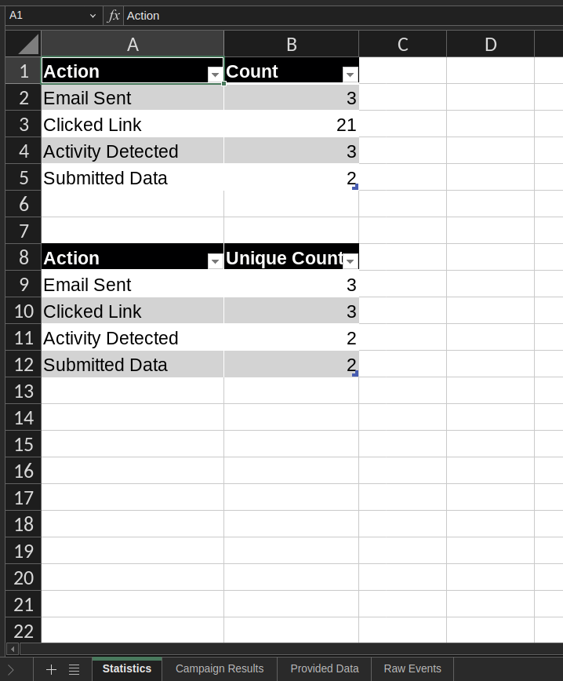
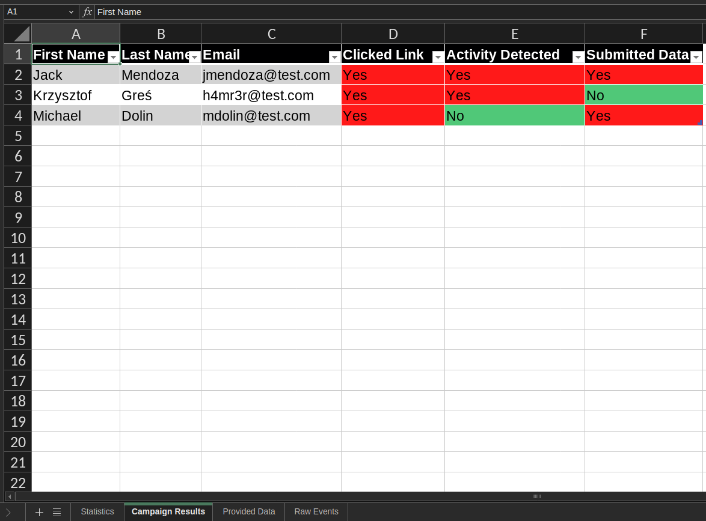
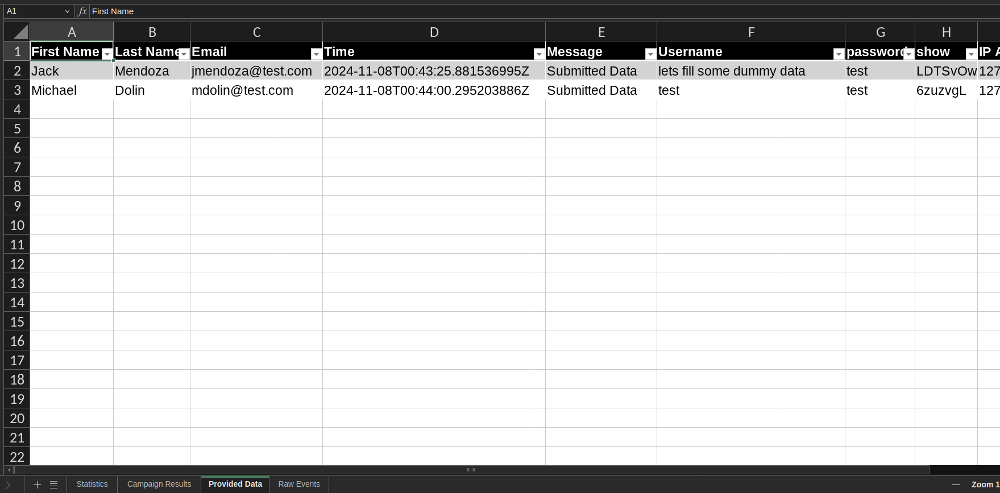
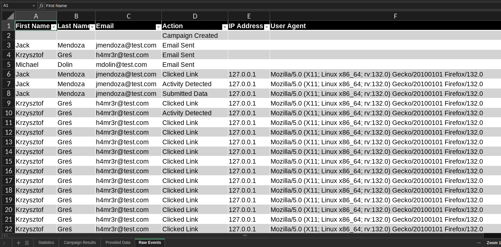

+++
title = 'JellyPhish - Reporting Update'
date = 2024-01-01T11:00:00-07:00
draft = false
tags = ['Phishing','SocialEngineering']
briefSummary = "I've introduced reporting python script for generating XLSX files"
thumbImage = "/posts/jellyphish.jpg"
+++

## My modification of GoPhish - Reporting Update

### Reporting
When downloading the raw Events in csv format, operator can generate report using JellyReporter script.

### Statistics sheet

  

### Campaign results sheet

  

### Provided data sheet

  

### Raw Events sheet

  

### Checkout the project
[GitHub](https://github.com/h4mr3r/jellyphish)