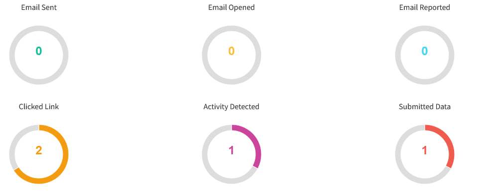

+++
title = 'JellyPhish'
date = 2024-01-01T11:00:00-07:00
draft = false
tags = ['Phishing','SocialEngineering']
briefSummary = "Gophish modification that introduces new statistic called \"Activity Detected\" and providing few upgrades."
thumbImage = "/posts/jellyphish.jpg"
+++

## My modification of GoPhish

| Status | Task                               | Description                                                                                                                                   |
|--------|------------------------------------|-----------------------------------------------------------------------------------------------------------------------------------------------|
| ☑️     | Activity detected statistic        | Statistic that is detecting if the link was opened in real browser - it could be useful when sandbox arrives. It could be added with the landing page section. |
| ☑️     | Displaying proper data in charts   | So gophish has a system that is showing statistic in wrong way. Now every event is collected and displayed. F.e submitted data does not mean that link was clicked.  |
| ☑️     | Report		                       | So gophish only returns basic data from the campaign. Now I am working to add ability to generate PDF overview report and advanced XLSX report.             |

## Updates

### Activity detected statistic
This new feature 'recognizes' valid users (well it tries):

  

A new statistic titled "Activity Detected" has been introduced for cases when many sandboxes don't even access the page through a browser - perfect for phishing campaigns that have a lot of undefined security mechanisms.

  

### Displaying proper data in charts
Well, I think the best way to describe it is to show how it works.

  

Every event is now collected separately. In this case, there were 3 users:
- User 1 clicked a link - resulting in the activity detected statistic and clicked link.
- User 2 didn't enter the link but it was opened using a GET request, without user activity.
- User 3 just submitted data using a POST request, so there was no user activity.

### Checkout the project
[GitHub](https://github.com/h4mr3r/jellyphish)